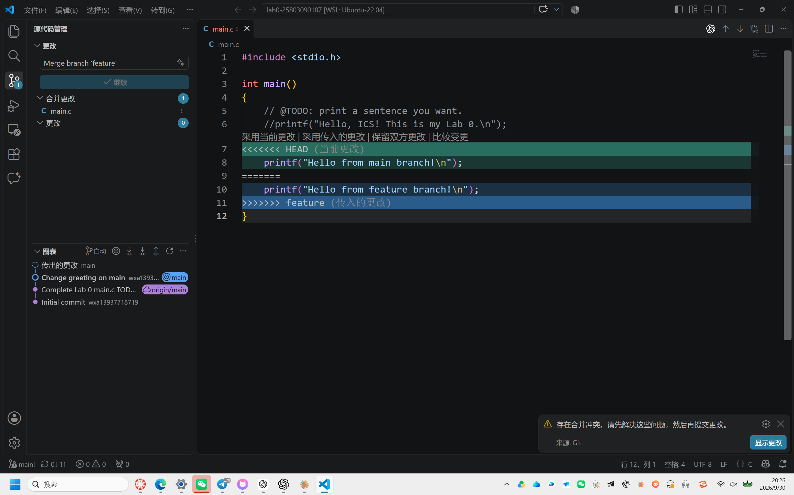
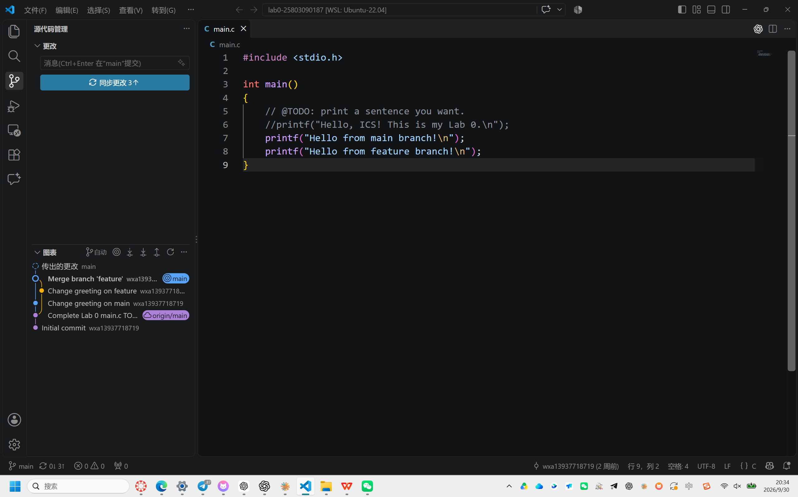

# Lab 0：Git 实验报告

个人仓库：https://github.com/wxa13937718719/lab0-25803090187

## 一、问题回答

### 1. 以前有过多人协同开发的经历吗？如何分工协作？

参加电子设计竞赛时，我们组三个人分别负责不同的模块，先各自编写代码，再把模块整合到一起。项目里既有 C 语言代码，也有 Python 代码。独立开发阶段各人可以推进自己的任务，但最后合并时，我们不得不对代码做大规模重构。这让我意识到，分工只解决了“谁来写”的问题，并没有自动解决“各部分怎样连接”的问题。

回看这次经历，如果能在开发前约定模块接口和数据格式，在开发过程中定期集成、测试并记录修改，最后整合时会更容易发现问题。Git 可以帮助我们保存各人的修改历史、并行开发和比较差异；而接口约定与跨语言的集成仍需要团队共同设计。两者配合才更有用。

### 2. Git 为什么设计“暂存—提交”两个步骤？

我把工作区理解为正在编辑的文件，暂存区理解为“准备放进下一次提交的内容”，提交则是把暂存区中的内容和提交说明一起保存到版本历史。这样，我不必把工作区里所有改动一次性提交。例如，若我已经完成 `main.c` 的修改，同时还在草拟报告，可以先只暂存 `main.c`，检查本次提交包含的内容，再以明确的说明提交；报告可以等写好后单独提交。

这种设计也方便在提交前检查遗漏或误加的文件。若发现某个修改暂时不应进入本次提交，可以调整暂存内容。将不同目的的修改分成几次提交，日后查看历史时，更容易看懂每次修改解决了什么问题。暂存本身还不是一次正式提交，只有执行提交后，版本历史才会增加一条记录。

### 3. `git branch` 和 `git branch -a` 有什么区别？

不带参数的 `git branch` 默认列出本地分支。在本实验中，本地分支包括 `main` 和 `feature`；当前所在分支前会有 `*`。加上 `-a`（`--all`）后，列表还会显示远程跟踪分支，例如 `remotes/origin/main` 和 `remotes/origin/feature`。

远程跟踪分支是本地记录的远端状态，并不意味着实时读取了 GitHub 上的最新内容。因此，`main` 和 `origin/main` 也可能暂时指向不同的提交：本地创建提交但还没推送时就是如此。本实验合并完成后，VS Code 显示本地有待同步的提交；同步之后，本地 `main` 与 `origin/main` 才再次指向同一提交。

## 二、实验过程

### 1. 建立仓库并完成第一次修改

我使用课程提供的模板建立个人仓库，将它克隆到 WSL 中的 `/home/wxa/ics-labs/lab0-25803090187`，随后用 VS Code 打开仓库。在 `main` 分支的 `main.c` 中，我根据 TODO 加入了以下输出语句：

```c
printf("Hello, ICS! This is my Lab 0.\n");
```

这句代码输出的文字是 `Hello, ICS! This is my Lab 0.`。我在 VS Code 的“源代码管理”中暂存修改并创建提交 `Complete Lab 0 main.c TODO`。这次提交记录了完成 TODO 后的版本，也成为后续两个分支共同的起点。

### 2. 在两个分支上分别修改同一处代码

我从 `main` 创建 `feature` 分支。在 `feature` 上，我把原先的输出语句注释掉，在同一位置加入 `printf("Hello from feature branch!\n");`，然后创建提交 `Change greeting on feature`。

接着我切回 `main`。此时看到的仍是该分支自己的文件版本，没有 `feature` 上的新语句。我同样注释掉原先的输出语句，但改为加入 `printf("Hello from main branch!\n");`，创建提交 `Change greeting on main`。这样两个分支从相同的基础版本出发，却对 `main.c` 的同一片代码给出了不同结果。

### 3. 合并并观察冲突

切换到 `main` 后，我在 VS Code 的源代码管理中选择合并本地 `feature` 分支。这一步相当于在 `main` 上执行 `git merge feature`。Git 可以合并互不干扰的修改，但这次两个分支都改动了同一位置的输出语句，无法自动判断该保留哪一个，于是暂停合并，要求我手动处理。

打开冲突文件后，我看到了 `<<<<<<< HEAD`、`=======` 和 `>>>>>>> feature`。其中 `HEAD` 一侧是当前 `main` 分支的 `Hello from main branch!`，另一侧是准备合入的 `feature` 分支的 `Hello from feature branch!`。如果两个分支修改的是不同位置，Git 通常可以自动合并；为了在本实验中触发冲突，我特意让它们修改同一处代码，并先在两个分支各自提交，再进行合并。



### 4. 解决冲突并完成合并

我选择了 VS Code 提供的“保留双方更改”，使两条 `printf` 都留在 `main.c` 中，分别输出来自两个分支的文字。随后检查文件：冲突标记已消失，代码中只剩正常的 C 语句。此时仅修改文件还不足以完成合并；我把 `main.c` 暂存，告诉 Git 这个冲突已经解决，再点击“继续”，生成合并提交 `Merge branch 'feature'`。

合并后的提交图表出现了两条分支汇合的形状，能看到 `Change greeting on main`、`Change greeting on feature` 和合并提交。最后我将 `main` 同步到 GitHub。图中的分叉与合流说明两条分支确实各自提交过修改，随后被合并，而不是在单一分支上连续改了两次。



### 5. 编译与运行检查

我在仓库所在的 WSL 环境依次执行 `make`、`./main`、`make clean`。`make` 使用仓库中的 Makefile 调用 `gcc` 编译 `main.c`；执行程序后，终端实际显示：

```text
Hello from main branch!
Hello from feature branch!
```

两句输出的顺序与解决冲突后文件里的顺序一致。`make clean` 随后删除编译生成的文件。这一步也检查了合并结果：如果把 `<<<<<<<` 等冲突标记留在 C 文件中，编译就不能像这次一样顺利通过。

## 三、阅读资料总结

### 1. Commit message 和 Change log 编写指南

这篇文章讨论了为什么要认真写提交说明。只写“修改文件”虽然也能提交，但之后很难从历史中看出修改的目的。文章介绍的规范把提交说明分为 Header、Body 和 Footer；常见的 Header 形式是 `type(scope): subject`，其中 `type` 可以说明这次是新增功能、修复问题、修改文档等，Body 则可以进一步解释修改的原因。清晰的提交说明便于浏览和筛选历史，也能为自动生成 Change log 提供材料。

本实验没有强制采用文章中的格式，但我已经能体会到提交说明的作用：看到 `Change greeting on feature`、`Change greeting on main` 和 `Merge branch 'feature'`，就能迅速分辨各个提交发生在哪一步。今后多人协作时，我希望提交说明既简短又能说清本次变动，而不是只写笼统的“update”。

### 2. Gitflow 使用规范

这篇文章介绍了按用途管理分支的方法。文中的 `master` 用于保存已发布的稳定版本，`develop` 用于汇集开发成果；新功能通常在独立的 `feature` 分支上实现，再合入开发分支。准备发布时可以使用 `release` 分支，线上紧急修复则可以从稳定版本创建 `hotfix` 分支。不同分支各司其职，团队成员就能并行工作，并知道修改应该从哪里开始、合到哪里去。

本实验只使用 `main` 和 `feature`，并没有完整实行 Gitflow。它仍让我理解了功能分支的作用：在 `feature` 上修改不会立即改动 `main`，只有合并后两边的工作才进入同一个版本。分支能隔离进行中的工作，但不能保证合并永远没有冲突；同一处代码被不同方式修改时，仍需理解双方意图并人工解决。文中的 `master` 与本实验的 `main` 是名称不同的主分支。

### 3. 语义化版本 2.0.0

语义化版本使用 `主版本号.次版本号.修订号`，也就是 `X.Y.Z`。如果对公共 API 做了不兼容的修改，应提高主版本号；如果增加了向下兼容的功能，应提高次版本号；如果只做向下兼容的问题修正，应提高修订号。例如在符合规范的前提下，`1.2.3` 修复兼容性问题可以变为 `1.2.4`。文章还强调：先要明确软件的公共 API，版本号才有可解释的“兼容”含义。

我理解版本号和 Git 提交承担的任务不同：Git 提交详细记录每次具体修改，而版本号面向使用软件的人，概括一次发布可能带来的兼容性影响。明确的版本规则能帮助团队决定何时可以安全升级，减少仅凭数字大小猜测改动范围的问题。

### 为什么要学习 Git

电赛时我们已经做了任务分工，但最后仍为整合付出了很大代价。这次 Lab 0 让我把 Git 的几个环节连起来理解：提交保存可追溯的版本；分支使不同工作能够并行；合并把各分支的成果放到一起；发生冲突时，Git 把分歧展示出来，由开发者选择最终内容；推送则让远端仓库保存和共享结果。

Git 对多人协作尤其有用，因为团队可以知道是谁在什么时间、为了什么修改了文件，也可以回到之前的版本检查问题。与此同时，Git 不会自动替我们设计 C 与 Python 模块之间的接口，也不会判断哪一种业务逻辑才正确。因此，学习 Git 的同时，还需要养成事先沟通接口、逐步集成和检查结果的习惯。
